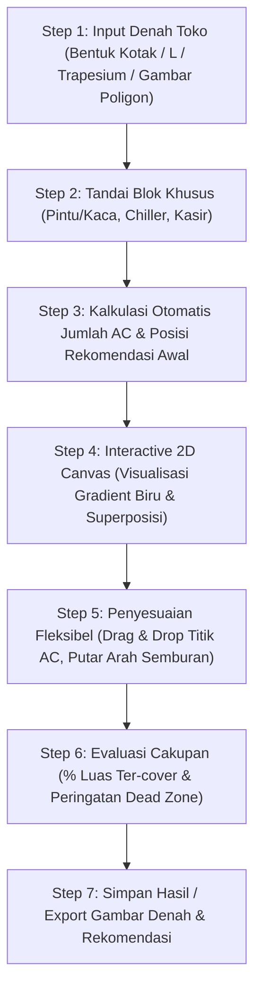

# Spesifikasi & Notula Desain: Kalkulator Layout & Pemetaan AC Sparta Energy

> **Status Dokumen:** Rancangan & Bahan Diskusi Teknis  
> **Tanggal Pembaruan:** 9 September 2026  
> **Proyek:** Sparta Energy Management System (`sparta-energy`)  
> **Topik:** Fitur Pemetaan Posisi AC Split Wall Berbasis Geometri Canvas & Thermal Gradient  

---

## 1. Latar Belakang & Tujuan

Sparta Energy telah memiliki:
1. **Kalkulator AC (`/ac-estimation`)**: Menghitung kebutuhan total BTU dan kuantitas unit AC berdasarkan luas area toko ($m^2$) dan suhu historis lingkungan (Open-Meteo API).
2. **Kalkulator Lampu (`/light-estimation`)**: Memiliki engine geometri 2D untuk membaca denah poligon ruangan (Kotak, Bentuk L, Trapesium, Poligon Kustom) dan menempatkan grid peralatan secara visual.

### **Tujuan Tool Baru (Kalkulator Layout AC)**:
Menggabungkan output rekomendasi unit dari Kalkulator AC dengan engine geometri Canvas 2D untuk memetakan **posisi pemasangan fisik AC di dinding secara presisi**, memvisualisasikan **sebaran hawa dingin (thermal gradient)**, serta mematuhi **aturan pembatasan zona toko retail** (chiller, kasir, kusen).

---

## 2. Spesifikasi Teknis Unit AC (Daikin 2 PK)

Berdasarkan kesepakatan diskusi, unit standar yang dimodelkan adalah **AC Split Wall 2 PK Daikin**:
- **Kapasitas Pendinginan**: $\approx 18.000\text{ BTU/h}$ per unit.
- **Airflow Rate**: $\approx 1.000 - 1.200\text{ m}^3/\text{jam}$ ($\approx 600 - 700\text{ CFM}$).
- **Luas Cakupan Efektif**: $\approx 30 - 36\text{ m}^2$ per unit (pada beban standar toko retail $600\text{ BTU/m}^2$).
- **Sudut Sebaran Hembusan (*Spread Angle*)**: **$60^\circ - 80^\circ$** (rata-rata pemodelan $70^\circ$).

### **Zonasi Sebaran Panjang Lemparan Angin (*Throw Distance*)**:
```
               [ UNIT AC 2 PK ] (Dinding)
                     \ | /         -> Sudut sebaran kipas ~70°
                      \|/
      (0 - 2.5 m)  █████████       -> Zona 1: Dingin Maksimal (Biru Pekat / Opacity 90%)
                  ███████████
      (2.5 - 5.5 m)░░░░░░░░░░░     -> Zona 2: Sejuk Efektif / Merata (Biru Sedang / Opacity 50%)
                 ░░░░░░░░░░░░░
      (5.5 - 7.5 m)···········     -> Zona 3: Batas Lemparan Angin (Biru Pudar / Opacity 15% -> 0%)
```

1. **Zona 1 (0 – 2.5 meter - Biru Pekat / Opacity 90%)**:
   - Area hembusan langsung (*core jet stream*).
   - Suhu udara keluar: $\sim 14^\circ\text{C} - 16^\circ\text{C}$, kecepatan angin: $1.5 - 2.5\text{ m/s}$.
2. **Zona 2 (2.5 – 5.5 meter - Biru Sedang / Opacity 50%)**:
   - Area pencampuran udara efektif (*entrainment zone*).
   - Suhu sejuk merata: $\sim 22^\circ\text{C} - 24^\circ\text{C}$, kecepatan angin: $0.25 - 0.5\text{ m/s}$.
3. **Zona 3 (5.5 – 7.5 meter - Biru Pudar / Opacity 15% $\rightarrow$ 0%)**:
   - Batas ujung dorongan kipas blower (*terminal velocity < 0.25 m/s*).

---

## 3. Konsep Visualisasi Canvas: Thermal Potential Gradient

### **A. Bentuk Sebaran (*Directional Fan Cone*)**
Setiap unit AC Split Wall digambarkan menempel pada segmen garis dinding (edge poligon) dengan arah semburan (vektor normal) menghadap ke dalam ruangan.

### **B. Logika Superposisi / Akumulasi (*Additive Blending*)**
- **Prinsip Fisika**: Jika 2 atau lebih unit AC menyemburkan udara ke satu area yang sama, kapasitas pendinginan di area tersebut saling menambah.
- **Implementasi Grafis**:
  $$\text{Intensitas Total }(x, y) = \min\left(1.0, \sum_{i=1}^N \text{Intensitas } AC_i(x, y)\right)$$
  - Jika area hanya terkena ujung pudar dari 1 AC $\rightarrow$ warna biru transparan.
  - Jika area tersebut **tertimpa semburan dari 2 AC sekaligus** $\rightarrow$ warna biru terakumulasi menjadi **biru pekat kembali**.

### **C. Deteksi Dead Zone (Area Kurang Dingin)**
- Area dalam poligon denah yang memiliki $\text{Intensitas Total} < 20\%$ akan ditandai dengan overlay peringatan (misal warna kuning/merah tipis) untuk menunjukkan adanya *dead zone* / area panas.

---

## 4. Aturan Penempatan Fisik & Batasan Ruang (*Placement & Constraint Rules*)

### **A. Aturan Blok Khusus / Zona Terlarang (*Restricted Zones*)**
Selain poligon denah toko, canvas mendukung penandaan blok-blok khusus:
1. **Area Kusen / Kaca / Pintu Depan**:
   - *Rule*: Dilarang menempatkan unit fisik indoor AC pada segmen dinding ini (karena tidak ada bidang dinding bata/dudukan bracket dan tingkat kebocoran panas tinggi).
2. **Area Open Chiller / Showcase Terbuka**:
   - *Rule*: Dilarang mengarahkan semburan AC langsung (*no direct draft*) ke arah muka open chiller agar tidak merusak tirai udara (*air curtain*) chiller yang dapat memicu bunga es dan boros listrik.
3. **Area Kasir**:
   - *Rule*: Jaga agar tidak ada semburan langsung kecepatan tinggi tepat di atas kepala kasir (*draft discomfort*).

### **B. Aturan Clearance & Jarak Fisik Antar AC**
- **Jarak Antar Unit di Dinding yang Sama**: Minimal $\ge 2.5 - 3.0\text{ meter}$ untuk menghindari *short-cycling* (udara dingin langsung tersedot unit tetangga).
- **Jarak dari Sudut/Pojokan Dinding**: Minimal $\ge 0.5 - 1.0\text{ meter}$ dari sudut pertemuan dua dinding agar sirkulasi udara samping tidak terhambat.

---

## 5. Alur Kerja Pengguna (User Flow)



---

## 7. Rangkuman & Rekapitulasi Cepat (Teks & Tabel Bersih)

Berikut adalah rangkuman cepat seluruh parameter, batasan jarak, dan aturan penempatan dalam format teks dan tabel bersih:

### A. Tabel Aturan & Batasan Penempatan

| Parameter / Aturan | Nilai / Standar | Keterangan Teknis |
| :--- | :--- | :--- |
| **Model Unit AC** | AC Split Wall 2 PK Daikin | Standar unit terpasang di toko |
| **Kapasitas Pendinginan** | 18.000 BTU/h per unit | Kapasitas pendinginan per unit |
| **Luas Cakupan Efektif** | 30 sampai 36 m2 per unit | Asumsi beban retail standar 600 BTU/m2 |
| **Sudut Sebaran Angin** | 70 derajat (rentang 60 - 80 derajat) | Pola hembusan kipas melebar ke depan |
| **Jarak Lemparan Maksimal** | 7.5 meter | Batas terjauh dorongan angin blower |
| **Jarak Minimal Antar AC** | Minimal 2.5 sampai 3.0 meter | Mencegah short-cycling (saling sedot udara dingin) |
| **Jarak Minimal dari Sudut Dinding** | Minimal 0.5 sampai 1.0 meter | Menjaga sirkulasi udara samping dari tembok |
| **Zona Pintu / Kusen / Kaca Depan** | Dilarang pasang unit AC fisik | Tidak ada tembok dudukan bracket & panas luar tinggi |
| **Zona Open Chiller / Showcase** | Dilarang semburan angin langsung | Mencegah rusaknya tirai udara dingin & boros listrik |
| **Zona Kasir** | Hindari semburan kencang langsung | Menjaga kenyamanan kerja staf kasir |

### B. Tabel Zonasi Sebaran Hawa Dingin (Gradien Biru)

| Zona | Jarak dari AC | Warna di Canvas | Karakteristik Suhu & Hembusan |
| :--- | :--- | :--- | :--- |
| **Zona 1: Dingin Maksimal** | 0 sampai 2.5 meter | Biru Pekat (90% pekat) | Hembusan langsung, suhu 14 - 16 C, angin kencang (1.5 - 2.5 m/s) |
| **Zona 2: Sejuk Efektif** | 2.5 sampai 5.5 meter | Biru Sedang (50% pekat) | Udara sejuk rata, suhu nyaman 22 - 24 C, angin sepoi-sepoi |
| **Zona 3: Batas Lemparan** | 5.5 sampai 7.5 meter | Biru Pudar ke Transparan | Batas akhir dorongan angin, mengandalkan sirkulasi ruangan |

---

*Dokumen ini disimpan di [`docs/ac_layout_mapping_design_specification.md`](file:///d:/Coding/sparta-energy/docs/ac_layout_mapping_design_specification.md).*

