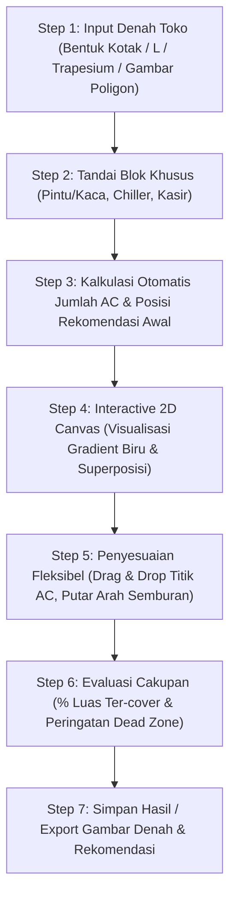

# Spesifikasi & Notula Desain: Kalkulator Layout & Pemetaan AC Sparta Energy

> **Status Dokumen:** Rancangan & Bahan Diskusi Teknis  
> **Tanggal Pembaruan:** 11 September 2026  
> **Proyek:** Sparta Energy Management System (`sparta-energy`)  
> **Topik:** Fitur Pemetaan Posisi AC Split Wall Berbasis Geometri Canvas, Thermal Gradient & Integrasi Tools  

---

## 1. Latar Belakang & Tujuan

Sparta Energy telah memiliki:
1. **Kalkulator AC (`/ac-estimation`)**: Menghitung kebutuhan total BTU dan kuantitas unit AC berdasarkan luas area toko ($m^2$) dan suhu historis lingkungan (Open-Meteo API).
2. **Kalkulator Lampu (`/light-estimation`)**: Memiliki engine geometri 2D untuk membaca denah poligon ruangan (Kotak, Bentuk L, Trapesium, Poligon Kustom) dan menempatkan grid peralatan secara visual.

### **Tujuan Tool Baru (Kalkulator Layout AC)**:
Menggabungkan output rekomendasi unit dari Kalkulator AC dengan engine geometri Canvas 2D untuk memetakan **posisi pemasangan fisik AC di dinding secara presisi**, memvisualisasikan **sebaran hawa dingin (thermal gradient)**, serta mematuhi **aturan pembatasan zona toko retail** (chiller, kasir, kusen).

---

## 2. Spesifikasi Teknis Unit AC (Daikin 2 PK)

Berdasarkan kesepakatan diskusi dan standar peremajaan toko, unit acuan yang dimodelkan adalah **AC Split Wall 2 PK Daikin (Standar Ritel)**:

### **A. Spesifikasi Dimensi Fisik & Elektrikal (Indoor Unit)**
- **Model / Seri Acuan**: Daikin High-Wall Split 2 PK (FTKC50 / FTV50 / FTNE50).
- **Dimensi Fisik Indoor ($P \times T \times L$)**: **$1.050\text{ mm} \times 290\text{ mm} \times 238\text{ mm}$**
  - **Panjang / Lebar Bodi ($P$)**: **$1{,}050\text{ meter}$ ($1.050\text{ mm}$)**
  - **Tinggi Bodi ($T$)**: **$0{,}290\text{ meter}$ ($290\text{ mm}$)**
  - **Ketebalan / Kedalaman ($L$)**: **$0{,}238\text{ meter}$ ($238\text{ mm}$)**
- **Berat Bersih Indoor**: $\approx 12 - 14\text{ kg}$.
- **Kapasitas Pendinginan**: $\approx 18.000\text{ BTU/h}$ ($5{,}27\text{ kW}$).
- **Konsumsi Daya Listrik**: $\approx 1.500 - 1.800\text{ Watt}$ (arus $\approx 7{,}5 - 8{,}5\text{ A}$).
- **Airflow Rate**: $\approx 1.000 - 1.200\text{ m}^3/\text{jam}$ ($\approx 600 - 700\text{ CFM}$).
- **Luas Cakupan Efektif**: $\approx 30 - 36\text{ m}^2$ per unit (pada beban standar toko retail $600\text{ BTU/m}^2$).
- **Sudut Sebaran Hembusan (*Spread Angle*)**: **$60^\circ - 80^\circ$** (rata-rata pemodelan $70^\circ$).

### **B. Batasan Dimensi Ruang & Sisa Dinding (*Wall Space Constraints*)**
1. **Panjang Dinding Minimum Absolut ($\ge 1{,}05\text{ m}$)**:
   - Sisa bidang dinding bata padat (*solid wall*) yang berukuran **$< 1{,}05\text{ m}$** (misalnya sisa dinding yang terjepit antara sudut tembok dan kusen pintu/kasir/chiller) **secara fisik TIDAK BISA dipasang unit AC**.
   - Sistem menandai dinding ini dengan label peringatan visual: `⚠️ <1.05m (Tidak Muat AC)`.
2. **Panjang Dinding Minimum Rekomendasi ($\ge 1{,}55\text{ m}$)**:
   - Memperhitungkan *side clearance* kiri dan kanan masing-masing $250\text{ mm}$ ($0{,}25\text{ m}$) dari sudut atau rintangan ($1{,}05\text{ m} + 2 \times 0{,}25\text{ m} = 1{,}55\text{ m}$).
   - Segmen dinding $1{,}05\text{ m} \le L < 1{,}55\text{ m}$ ditandai dengan label: `⚠️ <1.55m (Sempit)`.

### **C. Zonasi Sebaran Panjang Lemparan Angin (*Throw Distance*)**:
```
               [ UNIT AC 2 PK (1.050 mm) ] (Dinding)
                     \       |       /         -> Sudut sebaran kipas ~70°
                      \     \|/     /
      (0 - 2.5 m)      █████████████           -> Zona 1: Dingin Maksimal (Biru Pekat / Opacity 90%)
                      ███████████████
      (2.5 - 5.5 m)   ░░░░░░░░░░░░░░░          -> Zona 2: Sejuk Efektif / Merata (Biru Sedang / Opacity 50%)
                     ░░░░░░░░░░░░░░░░░
      (5.5 - 7.5 m)   ···············          -> Zona 3: Batas Lemparan Angin (Biru Pudar / Opacity 15% -> 0%)
```

1. **Zona 1 (0 – 2.5 meter - Biru Pekat / Opacity 90%)**:
   - Area hembusan langsung (*core jet stream*).
   - Suhu udara keluar: $\sim 14^\circ\text{C} - 16^\circ\text{C}$, kecepatan angin: $1.5 - 2.5\text{ m/s}$.
2. **Zona 2 (2.5 – 5.5 meter - Biru Sedang / Opacity 50%)**:
   - Area pencampuran udara efektif (*entrainment zone*).
   - Suhu sejuk merata: $\sim 22^\circ\text{C} - 24^\circ\text{C}$, kecepatan angin: $0.25 - 0.5\text{ m/s}$.
3. **Zona 3 (5.5 – 7.5 meter - Biru Pudar / Opacity 15% $\rightarrow$ 0%)**:
   - Batas ujung dorongan kipas blower (*terminal velocity < 0.25 m/s*).

---

## 3. Konsep Visualisasi Canvas: Thermal Potential Gradient

### **A. Bentuk Sebaran (*Wide-Mouth Directional Plume*)**
Setiap unit AC Split Wall digambarkan menempel pada dinding dengan pola hembusan udara dingin yang keluar dari **seluruh bentang lebar mulut louver kisi-kisi AC (panjang fisik indoor 1.05m)**, bukan dari satu titik runcing di tengah. Hembusan memancar ke depan menuju ruangan dengan sudut sebar $70^\circ$, dilengkapi garis streamline dari multi-titik louver serta busur gelombang jangkauan (3m, 5m, 6.5m).

### **B. Logika Superposisi / Akumulasi (*Additive Blending*)**
- **Prinsip Fisika**: Jika 2 atau lebih unit AC menyemburkan udara ke satu area yang sama, kapasitas pendinginan di area tersebut saling menambah.
- **Implementasi Grafis**:
  $$\text{Intensitas Total }(x, y) = \min\left(1.0, \sum_{i=1}^N \text{Intensitas } AC_i(x, y)\right)$$
  - Jika area hanya terkena ujung pudar dari 1 AC $\rightarrow$ warna biru transparan.
  - Jika area tersebut **tertimpa semburan dari 2 AC sekaligus** $\rightarrow$ warna biru terakumulasi menjadi **biru pekat kembali**.

### **C. Deteksi Dead Zone (Area Kurang Dingin)**
- Area dalam poligon denah yang memiliki $\text{Intensitas Total} < 20\%$ akan ditandai dengan overlay peringatan (misal warna kuning/merah tipis) untuk menunjukkan adanya *dead zone* / area panas.

---

## 4. Aturan Penempatan Fisik & Batasan Ruang (*Placement & Constraint Rules*)

### **A. Aturan Blok Khusus & Alasan Teknis Lapangan (*Restricted Zones*)**
1. **Area Kusen / Kaca / Pintu Depan**:
   - *Rule*: Dilarang menempatkan unit fisik indoor AC pada segmen dinding ini.
   - *Alasan*: Tidak ada bidang dinding bata/dudukan bracket struktural yang kuat dan tingkat radiasi kebocoran panas dari luar sangat tinggi.
2. **Area Open Chiller / Showcase Terbuka**:
   - *Rule*: Dilarang menempatkan unit fisik AC di dinding tepat di atas chiller dan dilarang mengarahkan semburan AC langsung (*no direct draft*) ke arah muka open chiller.
   - *Alasan*:
     - **Akses Servis & Maintenance**: Bodi chiller menghalangi tangga teknisi saat cuci AC/servis berkala.
     - **Risiko Kebocoran Air Kondensasi**: Pipa/talang AC yang tersumbat berisiko meneteskan air langsung ke dalam produk display atau modul kelistrikan chiller.
     - **Kerusakan Tirai Udara (*Air Curtain*)**: Hembusan angin kencang mengoyak lapisan udara dingin internal chiller sehingga memicu bunga es dan pemborosan listrik kompresor.
3. **Area Kasir / Meja POS**:
   - *Rule*: Dilarang memasang unit fisik di dinding belakang/atas kasir dan hindari semburan kencang langsung ke meja POS.
   - *Alasan*:
     - **Halangan Properti & Visual**: Dinding area kasir dipenuhi rak rokok (*backwall*), layar TV *Menu Board*, papan neon box promosi, dan instalasi POS yang menghalangi sirkulasi hisap/hembus AC.
     - **Kenyamanan Staf (*Thermal Comfort*)**: Menghindari *draft discomfort* bagi staf kasir yang bertugas diam di satu titik sepanjang waktu shift.

### **B. Mekanisme Penandaan di Interactive Canvas**
1. **Penandaan Segmen Garis Dinding (Wall Edge Toggle)**:
   - User mengklik segmen garis dinding poligon toko untuk mengubah statusnya:
     - 🧱 *Dinding Solid (Bata)*: Garis tegas abu-abu/hitam (Bisa dipasang AC).
     - 🚪 *Kusen / Kaca / Pintu Depan*: Garis oranye strip putus-putus (`- - -`) dengan label *"Kaca/Pintu"*.
     - 🚫 *Dinding Terhalang Properti (Backwall Kasir)*: Garis merah strip dengan label *"Terhalang"*.
   - Segmen garis terlarang memiliki fitur **Snap Prevention** (titik AC otomatis menolak/mengunci jika ditarik ke garis ini).
2. **Penandaan Blok Fixture Lantai (Furniture Blocks)**:
   - Tersedia tombol cepat **`+ Tambah Blok Chiller`** (kotak berarsir Cyan 🧊) dan **`+ Tambah Meja Kasir`** (kotak berarsir Kuning/Oranye 🛒).
   - Blok dapat digeser (*drag*) merapat ke dinding. Dinding di belakang blok chiller otomatis terkunci.
   - **Collision Warning**: Jika kerucut semburan AC ($70^\circ$) mengarah langsung ke muka blok chiller ($< 3.5\text{ m}$), garis semburan berubah warna kuning/merah dengan peringatan aktif.

### **C. Aturan Clearance & Jarak Fisik Antar AC**
- **Jarak Antar Unit di Dinding yang Sama**: Minimal $\ge 2.5 - 3.0\text{ meter}$ untuk menghindari *short-cycling* (udara dingin langsung tersedot unit tetangga).
- **Jarak dari Sudut/Pojokan Dinding**: Minimal $\ge 0.5 - 1.0\text{ meter}$ dari sudut pertemuan dua dinding agar sirkulasi udara samping tidak terhambat.

---

## 5. Alur Kerja Pengguna (User Flow)



---

## 6. Keputusan Desain Produk & Integrasi Arsitektur

### **A. Model Akses Ganda (Two-Way Accessibility)**
Fitur ini dibangun sebagai **tool baru tersendiri (`/ac-layout`)**, namun terhubung secara mulus dengan alat yang sudah ada:
1. **Pintu Akses 1 (Alur Lanjutan dari Kalkulator AC - `/ac-estimation`)**:
   - Setelah user menghitung kebutuhan BTU dan memperoleh hasil (misal: 4 unit Daikin 2 PK), terdapat tombol aksi **"Petakan Posisi di Denah (Visual Layout) ➔"**.
   - Sistem melakukan *seamless redirect* ke `/ac-layout` dengan menyertakan parameter toko, luas, dan kuantitas unit awal secara otomatis.
2. **Pintu Akses 2 (Akses Cepat dari Dashboard Utama)**:
   - Terdaftar di `CalculatorGrid` sebagai kartu mandiri berdampingan dengan Kalkulator AC dan Kalkulator Lampu.
   - Auditor toko eksisting dapat langsung menggambar denah dan mengevaluasi posisi AC tanpa kewajiban mengisi form cuaca/GPS terlebih dahulu.

### **B. Konsistensi Acuan & Resolusi Selisih Unit (Beban Termal vs Tata Letak Fisik)**
- **Baseline Acuan Tetap**: Menggunakan formula baku Kalkulator AC (Kapasitas per unit Daikin 2 PK = 18.000 BTU/h, klaster suhu Open-Meteo 450 / 600 / 751 BTU/m²).
- **Penanganan Fenomena Selisih Angka Lapangan**:
  1. *Kasus Rekomendasi Beban 5 Unit $\rightarrow$ Di Denah Cukup 4 Unit*:
     - Terjadi karena luas lantai terpotong blok Open Chiller/Gudang (luas efektif berkurang), atau bentuk ruangan persegi kompak sehingga 4 unit sudah mencapai superposisi cakupan $\ge 90\%$.
  2. *Kasus Rekomendasi Beban 4 Unit $\rightarrow$ Di Denah Memerlukan 5 Unit*:
     - Terjadi pada ruangan berbentuk huruf L, banyak sekat, atau lorong memanjang di mana lemparan angin 7.5 meter tidak dapat berbelok ke sudut mati (*dead zone*).
- **Panel Evaluasi Ganda & Smart Insight**:
  Antarmuka menampilkan panel komparasi transparan antara **Target Beban Termal (BTU)** dan **Persentase Cakupan Denah Fisik (%)** disertai catatan cerdas (*smart insights*) untuk memberikan justifikasi penghematan CAPEX/OPEX yang valid bagi manajemen dan tim audit.

---

## 7. Rangkuman & Rekapitulasi Cepat (Teks & Tabel Bersih)

Berikut adalah rangkuman cepat seluruh parameter, batasan jarak, dan aturan penempatan dalam format teks dan tabel bersih:

### A. Tabel Aturan & Batasan Penempatan

| Parameter / Aturan | Nilai / Standar | Keterangan Teknis Lapangan |
| :--- | :--- | :--- |
| **Model Unit AC** | AC Split Wall 2 PK Daikin (High-Wall) | Standar unit terpasang di toko retail |
| **Dimensi Fisik Indoor (P x T x L)** | 1.050 mm x 290 mm x 238 mm | Panjang 1,05 m, tinggi 29 cm, tebal 23,8 cm |
| **Kapasitas Pendinginan** | 18.000 BTU/h (5,27 kW) per unit | Kapasitas pendinginan per unit |
| **Konsumsi Daya Listrik** | 1.500 - 1.800 Watt (arus 7,5 - 8,5 A) | Daya beban operasional per unit |
| **Panjang Sisa Dinding Minimum Absolut** | Minimal >= 1.05 meter (1.050 mm) | Sisa dinding < 1,05 m TIDAK MUAT / dilarang pasang AC |
| **Panjang Sisa Dinding Rekomendasi** | Minimal >= 1.55 meter (1.550 mm) | Menampung bodi AC 1,05 m + clearance kiri-kanan @25 cm |
| **Luas Cakupan Efektif** | 30 sampai 36 m2 per unit | Asumsi beban retail standar 600 BTU/m2 |
| **Sudut Sebaran Angin** | 70 derajat (rentang 60 - 80 derajat) | Pola hembusan kipas melebar ke depan |
| **Jarak Lemparan Maksimal** | 7.5 meter | Batas terjauh dorongan angin blower |
| **Jarak Minimal Antar AC** | Minimal 2.5 sampai 3.0 meter | Mencegah short-cycling (saling sedot udara dingin) |
| **Jarak Minimal dari Sudut Dinding** | Minimal 0.25 sampai 0.5 meter | Menjaga sirkulasi udara samping dari tembok |
| **Pintu / Kusen Depan (Kaca)** | Fleksibel (bebas 2-klik) | Pintu entrance toko atau kaca fasad depan |
| **Pintu P1 (Gudang)** | Standar Baku 1.0 meter (1-klik pasang) | Pintu penghubung area sales ke area gudang/backroom |
| **Open Chiller / Showcase** | Standar Modul 1.2 meter per unit | Disediakan stepper [ - ] N Unit [ + ] (1 unit = 1.2m, 2 unit = 2.4m, dst.) |
| **Pergeseran Blok Baku (P1 & Chiller)** | Geser kedua titik serentak (Whole Block Drag) | Panjang fisik objek terkunci saat digeser di sepanjang dinding |
| **Magnetic Snap Chiller** | Snap otomatis jika jarak < 0.15 meter | Indikator visual hijau (Rapat Berdampingan) untuk deretan chiller |
| **Zona Pintu / Kusen / Kaca Depan** | Dilarang pasang unit AC fisik | Tidak ada tembok dudukan bracket & beban radiasi luar tinggi |
| **Zona Open Chiller / Showcase** | Dilarang pasang di atas & semburan langsung | Mencegah kerusakan air curtain, akses servis terhalang, & tetesan air |
| **Zona Kasir** | Dilarang pasang di atas & semburan kencang | Terhalang TV menu/backwall/rak rokok & menjaga kenyamanan kerja kasir |

### B. Tabel Zonasi Sebaran Hawa Dingin (Gradien Biru)

| Zona | Jarak dari AC | Warna di Canvas | Karakteristik Suhu & Hembusan |
| :--- | :--- | :--- | :--- |
| **Zona 1: Dingin Maksimal** | 0 sampai 2.5 meter | Biru Pekat (90% pekat) | Hembusan langsung, suhu 14 - 16 C, angin kencang (1.5 - 2.5 m/s) |
| **Zona 2: Sejuk Efektif** | 2.5 sampai 5.5 meter | Biru Sedang (50% pekat) | Udara sejuk rata, suhu nyaman 22 - 24 C, angin sepoi-sepoi |
| **Zona 3: Batas Lemparan** | 5.5 sampai 7.5 meter | Biru Pudar ke Transparan | Batas akhir dorongan angin, mengandalkan sirkulasi ruangan |

---

## 8. Daftar Pustaka & Rujukan Normatif (*Normative References*)

Berikut adalah referensi tertulis resmi yang mendasari parameter teknis, aturan jarak, dan batasan penempatan AC dalam sistem ini:

1. **Pabrikan & Manual Book (Daikin)**:
   - *Daikin Room Air Conditioner Installation Manual (Wall-Mounted Series FTKC / FTV 2 PK)*: Ketentuan *side clearance* ($\ge 50 - 500\text{ mm}$), *ceiling clearance*, dan pencegahan *discharge obstruction*.
   - *Daikin Engineering Data Book / Service Manual (FTKC50 / FTV50 Series)*: Data laju aliran volume udara indoor ($17.5 - 19.8\text{ m}^3/\text{menit} \approx 600 - 700\text{ CFM}$) dan profil *air velocity distribution / throw distance*.
   - Portal Resmi: [Daikin Indonesia Technical Portal](https://www.daikin.co.id/) & [Daikin Comfort Technical Resources](https://www.daikincomfort.com/).

2. **Standar Rekayasa Termal Internasional (ASHRAE)**:
   - *ASHRAE Handbook — Fundamentals (Chapter: Space Air Diffusion)*: Definisi *Throw Distance* pada *terminal velocity* $V_t = 0.25\text{ m/s}$, teori *Turbulent Free Jet* (sudut sebaran $60^\circ - 70^\circ$), dan *Air Diffusion Performance Index* (ADPI).
   - *ASHRAE Standard 55 (Thermal Environmental Conditions for Human Occupancy)*: Batasan *Draft Rate* (DR) dan kenyamanan termal bagi pekerja statis (*stationary occupants* / staf kasir).
   - *ASHRAE Handbook — Refrigeration (Chapter: Retail Food Store Refrigeration Systems)* & *ANSI/ASHRAE Standard 72*: Pengaruh hembusan angin HVAC toko terhadap stabilitas tirai udara (*air curtain*) open chiller.

3. **Jurnal & Penelitian Ilmiah**:
   - *Foster, A.M., et al.* (International Journal of Refrigeration): *"Effect of ambient air movement on the performance of refrigerated display cabinets"* ([DOI: 10.1016/j.ijrefrig.2004.11.006](https://doi.org/10.1016/j.ijrefrig.2004.11.006)) — Bukti ilmiah bahwa hembusan AC yang mengarah langsung ke open chiller merusak tirai udara dan menaikkan beban infiltrasi panas 67%–81%.
   - *MDPI Energies*: *"Investigation on Air Curtain Performance and Infiltration Load of Open Refrigerated Display Cabinets"* ([MDPI Article](https://www.mdpi.com/1996-1073/14/19/6257)).

4. **Pedoman MEP Toko Retail Modern**:
   - Standar teknis fit-out minimarket/supermarket terkait zonasi bebas kondensasi di atas chiller display dan zonasi perabotan kasir/backwall.

---

*Dokumen ini disimpan di [`docs/ac_layout_mapping_design_specification.md`](file:///d:/Coding/sparta-energy/docs/ac_layout_mapping_design_specification.md).*

