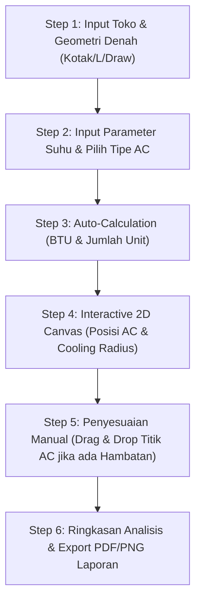

# Proposal & Spesifikasi Desain: Kalkulator Mapping Penempatan AC Otomatis

> **Dokumen Bahan Diskusi Tim & Stakeholder**  
> **Status:** Draft / Proposal  
> **Tanggal:** 23 Juli 2026  
> **Proyek:** Sparta Energy Audit Management System  

---

## 1. Latar Belakang & Tujuan

Saat ini, sistem **Sparta Energy** telah memiliki:
1. **Kalkulator Estimasi AC (`/ac-estimation`)**: Menghitung kebutuhan total BTU dan unit AC berdasarkan luas area penjualan ($m^2$) dan suhu lingkungan (OpenMeteo API). Namun, hasilnya masih berupa angka kuantitas unit dan belum memiliki pemetaan posisi visual di denah toko.
2. **Kalkulator Estimasi Lampu (`/light-estimation`)**: Memiliki engine geometri 2D yang mampu membaca bentuk denah toko (Kotak, Trapesium, Bentuk L, Polygon Kustom) dan secara otomatis menempatkan grid posisi lampu secara visual.

### **Tujuan Proposal**
Mengintegrasikan kekuatan logika geometri 2D dari Kalkulator Lampu dengan kalkulasi beban termal dari Kalkulator AC untuk membangun **Kalkulator Mapping Penempatan AC Otomatis**. Tools ini akan membantu auditor dan manajemen toko dalam:
- Mengetahui **jumlah unit AC** yang dibutuhkan secara presisi.
- Menentukan **titik lokasi penempatan AC yang optimal** pada denah toko.
- Memvisualisasikan **sebaran hawa dingin (Airflow & Cooling Coverage)** guna menghindari area panas (*dead zone*) atau pemborosan pendinginan (*overcooling*).

---

## 2. Perbandingan Fitur: Kalkulator Lampu vs. Mapping AC

| Parameter / Fitur | Kalkulator Estimasi Lampu | Kalkulator Mapping AC (Rencana) |
| :--- | :--- | :--- |
| **Metrik Utama** | Densitas Cahaya ($W/m^2$ / Lux) | Beban Panas & Kapasitas ($BTU/m^2$ & Airflow) |
| **Pola Penempatan** | Grid simetris melintasi seluruh plafon | Penempatan Zonasi (Pusat Ruangan / Dinding Perimeter) |
| **Kriteria Jarak** | Jarak antar lampu & ke dinding | Radius jangkauan angin AC ($3 - 5\text{ m}$) & simetri ruangan |
| **Tipe Peralatan** | Lampu Tube / LED 13.5W | AC Cassette (Ceiling 360°) / AC Split Wall (1 Arah) |
| **Visualisasi Canvas** | Titik lampu & orientasi (Horizontal/Vertikal) | Titik AC, Vektor Angin, & Radius Gradien Suhu (*Cooling Circle*) |

---

## 3. Spesifikasi Arsitektur & Logika Sistem

### **A. Input Data Sistem**
1. **Identitas Toko & Suhu**:
   - Pilihan Toko terdaftar atau Toko Baru.
   - Fetching suhu lokasi via OpenMeteo API (menentukan *Cluster BTU*: 450, 600, atau 751 BTU/$m^2$).
2. **Bentuk & Geometri Ruangan**:
   - **Preset 1**: Kotak Tidak Simetris (Panjang $A, B$, Lebar $C, D$)
   - **Preset 2**: Trapesium
   - **Preset 3**: Bentuk L
   - **Preset 4**: Polygon Kustom (Draw Points di Canvas)
   - **Input Tinggi Plafon (m)** untuk estimasi volume udara ($m^3$).
3. **Spesifikasi Tipe AC**:
   - **AC Cassette (Ceiling)**: Menyebar 360 derajat (Misal: 3 PK / 5 PK).
   - **AC Split Wall (Dinding)**: Menyebar 1 arah utama (Misal: 2 PK / 1.5 PK).

---

### **B. Logika Perhitungan & Placement Engine**

#### **1. Perhitungan Load BTU & Jumlah Unit AC**
$$\text{Total BTU} = \text{Luas Area } (m^2) \times \text{Cluster BTU } (BTU/m^2)$$

$$\text{Jumlah Unit } (N) = \left\lceil \frac{\text{Total BTU}}{\text{Kapasitas Unit AC (BTU)}} \right\rceil$$

#### **2. Algoritma Spatial Layout (Penentuan Posisi $X, Y$)**

* **Skenario AC Cassette (Plafon / Ceiling Mounted)**:
  - Menggunakan algoritma **Polygon Centroid Partitioning** (pembagian zona berdasarkan luas).
  - Poligon toko dibagi menjadi $N$ buah sub-area seimbang.
  - Posisikan AC Cassette di pusat gravitasi geometri (*Centroid*) masing-masing sub-area agar jangkauan 360° menutup seluruh area tersebut.

* **Skenario AC Split Wall (Menempel Dinding / Wall Mounted)**:
  - Menggunakan algoritma **Edge Boundary Detection**.
  - Sistem mendeteksi segmen-segmen dinding terpanjang.
  - AC ditempatkan menempel pada dinding dengan vektor arah semburan (*airflow vector*) mengarah ke pusat ruangan / area terbuka terluas.

#### **3. Engine Visualisasi Hawa Dingin (Cooling Coverage)**
Canvas 2D akan menampilkan:
- Garis batas denah toko (Poligon).
- Ikon penempatan AC ($AC_1, AC_2, \dots, AC_N$).
- **Visualisasi Radius Dingin (*Cooling Circles*)**: Lingkaran transparan bertingkat dengan warna biru gradien untuk menunjukkan area efektif pendinginan.
- **Deteksi *Dead Zone***: Area poligon di luar radius pendinginan yang ditandai dengan warna peringatan (kuning/merah transparan).

---

## 4. Alur Pengalaman Pengguna (UI/UX Flow)

---

## 5. Rencana Tahapan Eksekusi (Development Roadmap)

| Fase | Item Pekerjaan | Output Artifact |
| :--- | :--- | :--- |
| **Fase 1** | Formulasi Algoritma Geometri & Placement AC | `lib/ac-placement-calculator.ts` |
| **Fase 2** | Pembuatan Komponen Visual Canvas 2D | `components/ac-estimation/ac-placement-canvas.tsx` |
| **Fase 3** | Pembangunan Halaman Interface UI/UX | `app/ac-mapping/ac-mapping-client.tsx` |
| **Fase 4** | Integrasi Export Image & Laporan PDF | Integrasi `html-to-image` & RAB Data |

---

## 6. Bahan Diskusi & Poin Masukan (Open Questions)

> [!NOTE]  
> Mohon masukan dari tim bisnis, teknis, dan auditor mengenai poin-poin berikut:

1. **Aturan Khusus Layout Toko**: Apakah ada batasan jarak minimal AC ke area kasir atau pintu masuk toko (area dengan *heat loss* tinggi)?
2. **Kombinasi Tipe AC**: Apakah perlu mendukung simulasi gabungan (misal: 2 AC Cassette di tengah + 1 AC Split di dekat kasir)?
3. **Fleksibilitas Drag-and-Drop**: Seberapa penting fitur pergeseran manual titik AC oleh auditor jika terdapat tiang/struktur fisik toko yang menghalangi?

---

*Dokumen ini disimpan di `docs/ac_mapping_calculator_proposal.md` untuk memudahkan peninjauan dan revisi bersama.*
